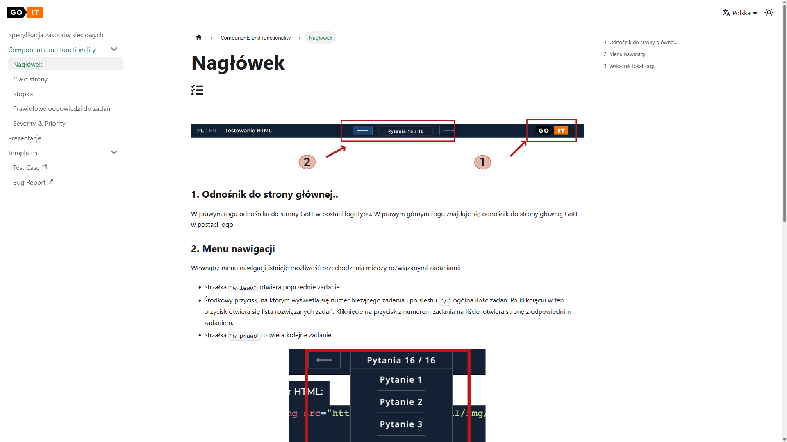
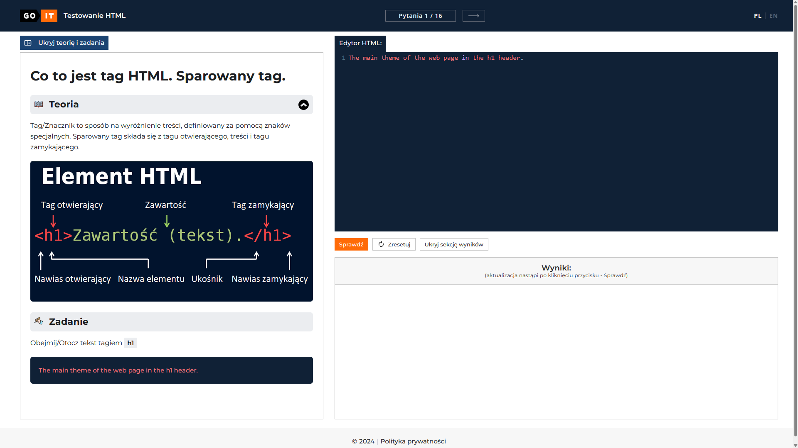

# manual-tester-portfolio

# 🎯 Portfolio QA Marathon

Portfolio zawiera rezultat udziału w **QA Maratonie [15.01.2024]**.

---

## 📄 Specyfikacja
Na podstawie specyfikacji:
[Specyfikacja projektu](https://faq-qa.m.goit.global/pl/?ssid=65a4d503e2edcd11923df9f0&cookie_id=1f7bf732b2634ec691b0e309943969a1&block_id=6446d433d3ac67261ac974ec&leeloo_account_id=65a4d503e2edcd3c793df9d3&utm_source=google&utm_medium=OR_PL&utm_campaign=OR_PL_QA_Marathon_Search&utm_term=651593759744&utm_content=150663570641)

  

---

## 🧪 Przypadki testowe
Stworzyłem kilka przypadków testowych w środowisku **TestRail**:  
[📂 Przypadki-testowe](./Przypadki-testowe)

---

## 🔍 Testy eksploracyjne
W trakcie **testów eksploracyjnych** na testowanej aplikacji:  
[💻 Testowana aplikacja](https://qa-autocheck-test.netlify.app/?token=d5fcc3783ba50fcac78b5a5ea8e4d69f6fe51ed8368bc618a58a846ad8b03a63&block=nop678917)

  

---

## 🐞 Zgłoszenia błędów
Wykonałem zgłoszenia błędów aplikacji w środowisku **Jira**:  
[📂 Bug reports](./Bug-reports)

---

## 👥 Zgłoszenia użytkowników
Ostatnim zadaniem było zgłoszenie błędów na podstawie zgłoszeń użytkowników:  
[📂 Bug reports - user ticket](./Bug-reports-user-ticket)

  

---

## 📌 Podsumowanie
- Dokumentacja przypadków testowych ✅  
- Testy eksploracyjne 🔍  
- Zgłoszenia błędów w Jira 🐞  
- Analiza zgłoszeń od użytkowników 👥  

---

> Portfolio pokazuje pełen cykl testowania: od **planowania przypadków testowych**, przez **testy eksploracyjne**, po **zgłoszenia błędów i analizę raportów użytkowników**.
